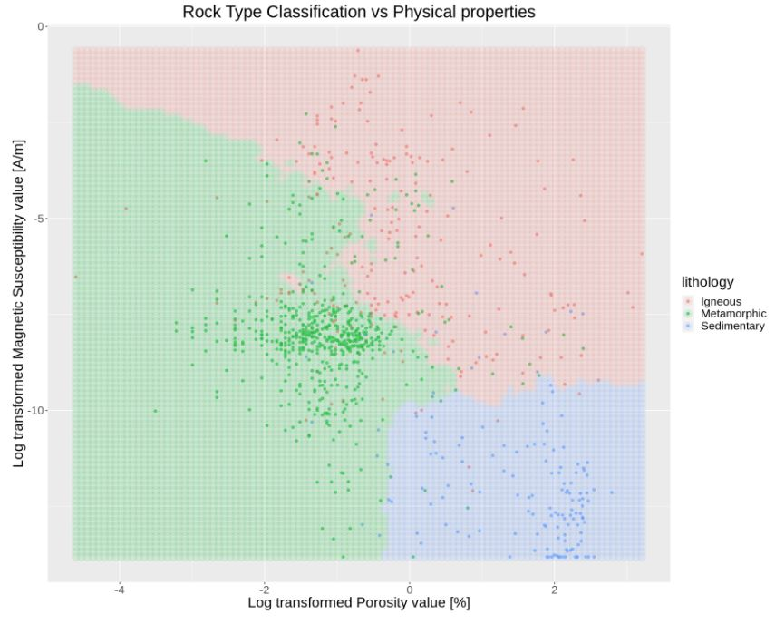

### Rock Physical Properties for Rock Type Classification

As our first data science group project in Data Science 100 at UBC, we applied the K-nearest neighbor algorithm to answer a classification problem: given the physical properties data of rock, whether it will be igneous, sedimentary, or metamorphic.  
We built the model with an iterative process and different visualization techniques are applied throughout the process. Feel free to explore the final report:   
  
RockTypeClassification_FinalReport.ipynb 

